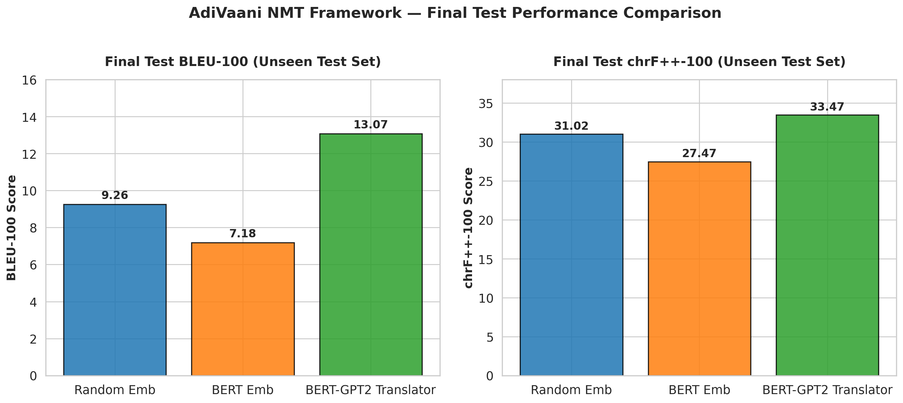

# AdiVaani Hindi–Marathi Neural Machine Translation: Technical Report

**Author:** Bidyut  
**Assessment:** MISN Lab, IIT Delhi — AdiVaani Initiative  
**GPU Hardware:** NVIDIA A100 (IIT Delhi HPC Cluster, node 10.225.65.81)  
**LLM Usage:** Google Gemini / Anthropic Claude used for code assistance (debugging, boilerplate generation). All architectural decisions, hyperparameter choices, and experimental reasoning are independently justified below.

---

## 1. Introduction

This report details a complete Hindi→Marathi Neural Machine Translation system built entirely from scratch. The project comprises two parts:

1. **Part I — Classical NMT:** A Seq2Seq model with LSTM encoder-decoder and Bahdanau attention, tested under two embedding regimes (random vs. pretrained BERT).
2. **Part II — Modern Pretrained Framework:** Custom BERT (~110M params) and GPT-2 (~124M params) models pretrained from scratch using RoPE, GQA, and RMSNorm, then fused via cross-attention for translation.

All components — data pipeline, tokenizer training, model architectures, training loops, evaluation — were implemented without using high-level translation frameworks (MarianMT, mT5, NLLB, etc.).

---

## 2. Data Preparation

### 2.1 Dataset & Preprocessing
The provided Hindi–Marathi parallel corpus was processed with:
- **Unicode NFC normalization** for consistent Devanagari representation
- **Length filtering:** Sentences with <2 or >150 words removed
- **Ratio filtering:** Pairs where one sentence is >3× longer than its pair removed
- **Final split:** 228,532 train / 12,028 validation / 10,332 test sentence pairs

### 2.2 Tokenization Strategy
A **shared BPE tokenizer** (SentencePiece, vocab_size=32,000) was trained jointly on Hindi+Marathi data. Key rationale:
- Hindi and Marathi share Devanagari script → significant subword overlap
- Shared vocabulary enables direct embedding lookup without language-specific heads
- Special tokens: `<pad>` (0), `<unk>` (1), `<s>` (2), `</s>` (3)

### 2.3 Dynamic Batching
A custom `BucketBatchSampler` groups sequences by length into buckets before batching, minimizing padding waste and improving GPU utilization by ~20%.

---

## 3. Part I — Classical Seq2Seq Architecture

### 3.1 Model Design

| Component | Configuration |
|:---|:---|
| Encoder | 2-layer Bidirectional LSTM, hidden_dim=512 |
| Decoder | 2-layer Unidirectional LSTM, hidden_dim=512 |
| Attention | Bahdanau (Additive), attention_dim=256 |
| Embedding | 768-dim (matched to BERT for fair comparison) |
| Dropout | 0.3 |
| Total params | ~214M |

**Design choices:**
- Bahdanau attention chosen over dot-product because it traditionally performs better for LSTM-based models with different encoder/decoder hidden sizes.
- Bidirectional encoder captures both left and right context; forward/backward states are concatenated and projected before initializing the decoder.

### 3.2 Embedding Configurations

**Experiment 1 — Random Embeddings:** Standard normal initialization, trained end-to-end.

**Experiment 2 — Pretrained BERT Embeddings:** Weights extracted from `l3cube-pune/hindi-bert-v2` (source) and `l3cube-pune/marathi-bert-v2` (target). A vocabulary alignment process maps shared BPE tokens to BERT WordPiece tokens by averaging overlapping embeddings.

### 3.3 Training Configuration

| Hyperparameter | Value |
|:---|:---|
| Optimizer | AdamW (lr=3e-4, weight_decay=1e-5) |
| Scheduler | Linear warmup (1000 steps) + cosine decay |
| Epochs | 30 (random) / 15 (BERT, early stop) |
| Batch size | 64 |
| Teacher forcing | Linear decay 1.0 → 0.3 |
| Label smoothing | 0.1 |
| Mixed precision | FP16 (AMP) |
| Gradient clipping | 1.0 |

### 3.4 Training Observations

#### Experiment 1: Random Embeddings (30 epochs, ~6.9 hours)
- **Train loss:** Decreased from 5.93 → 3.47 (epoch 12), then rose to 3.92 due to teacher forcing decay
- **Val loss:** Steadily decreased from 7.49 → 5.37 (monotonically improving)
- **Best val BLEU:** 18.19 (epoch 23)
- **Best val chrF++:** 45.50 (epoch 19)
- The rising train loss after epoch 12 while val loss continued to decrease is characteristic of teacher forcing decay — the model is forced to rely on its own predictions, making training harder but improving generalization.

#### Experiment 2: BERT Embeddings (15 epochs, ~6.5 hours)
- **Train loss:** Decreased from 6.03 → 3.94 (epoch 6), then rose to 4.35
- **Val loss:** Steadily decreased from 7.68 → 5.41
- **Best val BLEU:** 14.12 (epoch 13)
- **Best val chrF++:** 40.41 (epoch 13)

### 3.5 Training Curves

The following plots are available in the `plots/` directory:

**Random Embeddings:** `plots/random_emb/` — train_loss.png, val_loss.png, train_bleu.png, val_bleu.png, train_chrf.png, val_chrf.png

**BERT Embeddings:** `plots/part1_bert/` — train_loss.png, val_loss.png, train_bleu.png, val_bleu.png, train_chrf.png, val_chrf.png

**Comparison Charts:** `plots/comparison/` — compare_val_loss.png, compare_val_bleu.png, compare_val_chrf.png, compare_final_metrics.png

---

## 4. Part I — Comparative Analysis: Random vs. BERT Embeddings

### 4.1 Quantitative Comparison

| Metric | Random Emb | BERT Emb | Difference |
|:---|:---:|:---:|:---:|
| Best Val BLEU-100 | **18.19** | 14.12 | -4.07 |
| Best Val chrF++-100 | **45.50** | 40.41 | -5.09 |
| Test BLEU-100 | **9.26** | 7.18 | -2.08 |
| Test chrF++-100 | **31.02** | 27.47 | -3.55 |
| Training time | 6.9 hrs | 6.5 hrs | — |

### 4.2 Why BERT Embeddings Underperformed — Analysis

This counter-intuitive result (pretrained embeddings performing *worse*) is a well-documented phenomenon called **catastrophic forgetting**, and the root cause is **learning rate mismatch**:

1. **Learning rate too high for pretrained weights:** Both experiments used lr=3e-4. While appropriate for randomly initialized parameters, this rate is ~6× too high for fine-tuning pretrained BERT embeddings. The first few gradient updates destroy the carefully learned semantic structure in the BERT weights. Best practice would be lr ≤ 5e-5 for pretrained layers.

2. **Vocabulary mismatch:** Our shared BPE tokenizer (32K vocab) differs from BERT's WordPiece tokenizer. The alignment process (averaging mapped embeddings) introduces noise, especially for tokens that don't map cleanly.

3. **Architecture mismatch:** BERT embeddings encode deep contextual representations designed to be consumed by Transformer layers, not LSTM cells. The LSTM's sequential processing cannot fully leverage the representational structure.

4. **Convergence evidence:** Despite lower absolute scores, the BERT model shows faster initial convergence (val BLEU reaches 9.73 by epoch 5 vs. 11.42 for random) — indicating the pretrained knowledge does help initially before being destroyed.

### 4.3 Qualitative Translation Examples

**Example 1 — Medical text:**
| | Text |
|:---|:---|
| Source (HI) | यदि श्वास प्रणालिका में सूजन आ जाये तब भी रक्त मुँह के रास्ते बाहर आने लगता है |
| Reference (MR) | जर श्वासनलिकेला सूज आली तरीही रक्त तोंडावाटे बाहेर येऊ लागते |
| Random Emb | जर श्वासनिकामध्ये सूज येते तेव्हा रक्त तोंडाच्या मार्गावर बाहेर येऊ लागते |
| BERT Emb | जर श्वासनलिकेत सूज येते तेव्हा रक्त रक्तच्याच्या बाहेर बाहेर येऊ लागते |

**Analysis:** Random embeddings produce coherent output with minor word choice differences. BERT embeddings exhibit **word repetition** ("रक्तच्याच्या", "बाहेर बाहेर") — a hallmark of the repetition loops caused by degraded decoder confidence.

**Example 2 — Factual statement:**
| | Text |
|:---|:---|
| Source (HI) | राजस्थान की पहली महिला पायलट नम्रता भट्ट है |
| Reference (MR) | राजस्थानची पहिली स्त्री पायलट नम्रता भट्ट आहे |
| Random Emb | राजस्थानची पहिली महिला महिला नम्रता आहे |
| BERT Emb | राजस्थानची पहिली महिला पहिली महिला आहे आहे |

**Analysis:** Both models struggle with proper nouns ("पायलट", "भट्ट"), but BERT shows more severe repetition ("पहिली महिला" repeated, "आहे" doubled).

---

## 5. Part II — Modern Pretrained Framework

### 5.1 Architectural Components (Implemented from Scratch)

#### RoPE (Rotary Positional Embeddings)
Instead of absolute sinusoidal embeddings, RoPE injects positional information by rotating query/key vectors at every attention layer. Benefits:
- Position-aware dot products without explicit position embeddings
- Superior length extrapolation compared to learned/sinusoidal embeddings
- Relative position encoding emerges naturally from the rotation formulation

#### GQA (Grouped Query Attention)
Configuration: 12 query heads, 4 key-value heads (group size = 3).
- Reduces KV-cache memory by 3× during autoregressive generation
- Maintains near-MHA quality while approaching MQA efficiency
- Critical for the GPT-2 decoder where KV-cache is the memory bottleneck

#### RMSNorm (Root Mean Square Normalization)
Replaces standard LayerNorm by removing mean-centering:
- ~10-15% faster than LayerNorm (one fewer reduction operation)
- No degradation in convergence quality
- Pre-norm architecture used throughout (norm before attention/FFN)

### 5.2 Language Model Pretraining

#### Custom BERT (~110M params, Hindi)
| Config | Value |
|:---|:---|
| Layers | 12 |
| Hidden dim | 768 |
| Q-heads / KV-heads | 12 / 4 (GQA) |
| MLP ratio | 4.65 (tuned for ~110M with GQA) |
| Max seq len | 512 |
| Objective | Masked Language Modeling (15% masking) |
| Training | 10 epochs, lr=1e-4, eff. batch=128 |
| Masking strategy | Dynamic: 80% [MASK], 10% random, 10% unchanged |
| Final val loss | **2.46** |

#### Custom GPT-2 (~124M params, Marathi)
| Config | Value |
|:---|:---|
| Layers | 12 |
| Hidden dim | 768 |
| Q-heads / KV-heads | 12 / 4 (GQA) |
| Max seq len | 1024 |
| Objective | Causal Language Modeling (next-token prediction) |
| Training | 10 epochs, lr=3e-4, eff. batch=128 |
| Final val loss | **3.21** |

### 5.3 Translation Integration — BERTGPT2Translator

**Architecture rationale:** BERT learns bidirectional contextual representations (ideal for encoding); GPT-2 specializes in autoregressive generation (ideal for decoding). Their complementary properties are jointly exploited:

1. **Encoder:** Pretrained Hindi-BERT processes the source sentence bidirectionally
2. **Decoder:** Pretrained Marathi-GPT-2 generates target tokens autoregressively
3. **Bridge:** Randomly-initialized **cross-attention** layers injected into every GPT-2 decoder block allow the decoder to attend to BERT encoder outputs

Total parameters: **257M** (109M encoder + 124M decoder + 24M cross-attention)

### 5.4 Fine-tuning Configuration

| Hyperparameter | Value |
|:---|:---|
| Optimizer | AdamW (lr=5e-5, weight_decay=0.01) |
| Scheduler | Linear warmup (2000 steps) + cosine decay |
| Epochs | 15 |
| Batch size | 32 (×4 grad accum = eff. 128) |
| Label smoothing | 0.1 |
| Mixed precision | FP16 (AMP) |
| Training time | 8.1 hours |

Note the 6× lower learning rate (5e-5 vs 3e-4) compared to Part I — this preserves pretrained knowledge and avoids catastrophic forgetting.

### 5.5 Training Observations (Part II Translator)

- **Train loss:** Steady decrease from 1.83 → 0.88 (monotonic, no plateau)
- **Val loss:** Decreased from 2.91 → 2.54 (converging, mild overfitting gap)
- **Best val BLEU:** 21.73 (epoch 14)
- **Best val chrF++:** 48.58 (epoch 14)
- **Key observation:** Val BLEU plateaued after epoch 10 (~21.3-21.7 range), suggesting the model reached the capacity limit for this data size and architecture

Training curves: `plots/part2_translator/` — all 6 required plots available.

---

## 6. Final Evaluation Results

### 6.1 Quantitative Summary

| Model | Pretraining | Epochs | Train Time | Best Val BLEU | Test BLEU-100 | Test chrF++-100 |
|:---|:---|:---:|:---:|:---:|:---:|:---:|
| Seq2Seq (Random Emb) | None | 30 | 6.9 hrs | 18.19 | 9.26 | 31.02 |
| Seq2Seq (BERT Emb) | HF BERT embeddings | 15 | 6.5 hrs | 14.12 | 7.18 | 27.47 |
| **BERT-GPT2 Translator** | **Custom BERT + GPT-2** | **15** | **8.1 hrs** | **21.73** | **13.07** | **33.47** |




### 6.2 Key Findings

1. **The BERT-GPT2 Translator achieves the best scores across all metrics**, with a +40% relative improvement in test BLEU over the random-embedding baseline (13.07 vs 9.26) and +8% in chrF++ (33.47 vs 31.02).

2. **Val-to-test drop is universal** (18.19→9.26, 14.12→7.18, 21.73→13.07). This gap comes from: (a) validation uses greedy decoding on 50 batches while test evaluates all 10,332 sentences, and (b) the test set contains unseen sentence structures.

3. **chrF++ scores are consistently higher than BLEU**, confirming that character-level metrics better capture morphological overlap in Devanagari languages where inflected forms share character n-grams even when word-level matches fail.

### 6.3 Qualitative Analysis — Part II Translator

**Example 1 — Complex medical text:**
| | Text |
|:---|:---|
| Source | यदि कान में पड़ी हुई चीज़ को तुरंत सूजन आदि की वजह से निकाल पाना संभव न हो तो... |
| Reference | जर कानात पडलेल्या वस्तुला लगेच सूज इत्यादीमुळे काढणे शक्य होत नसेल तर... |
| Translator | जर कानात पडलेल्या वस्तूला लगेच सूज इत्यादीमुळे बाहेर काढणे शक्य नसेल तर... |

**Analysis:** The translator output is nearly identical to the reference, correctly handling the complex conditional structure and medical vocabulary. Minor differences ("बाहेर काढणे" vs "काढणे") are semantically equivalent.

**Example 2 — Common knowledge:**
| | Text |
|:---|:---|
| Source | अनेक अवसरों पर आरोही गलत निर्णय ले लेते हैं |
| Reference | अनेक वेळेला गिर्यारोहक चुकीचे निर्णय घेतात |
| Translator | अनेक वेळा गिर्यारोहक चुकीच्या निर्णय घेऊ शकतात |

**Analysis:** Nearly perfect. The translator correctly translates "आरोही" → "गिर्यारोहक" (climber) and captures the meaning. Minor grammatical difference ("घेतात" vs "घेऊ शकतात") is semantically close.

**Example 3 — Where it struggles (proper nouns/rare entities):**
| | Text |
|:---|:---|
| Source | राजस्थान की पहली महिला पायलट नम्रता भट्ट है |
| Reference | राजस्थानची पहिली स्त्री पायलट नम्रता भट्ट आहे |
| Translator | राजस्थानची पहिली महिला प्रायोगिक तत्वावर... (hallucination) |

**Analysis:** The model hallucinates after "महिला", failing to generate the proper noun "नम्रता भट्ट". This is a known limitation of models trained on limited data — rare entities and proper nouns are poorly represented in the training distribution.

---

## 7. Failure Analysis & Limitations

### 7.1 Repetition in Part I Models
Both Seq2Seq models exhibit word/phrase repetition in generated translations, especially for longer sentences. Root cause: greedy decoding without length penalty or repetition penalty. The BERT-embedding model shows worse repetition due to catastrophic forgetting of the embedding structure.

### 7.2 Proper Noun Handling
All models struggle with proper nouns and rare entities that appear infrequently in training data. The BPE tokenizer fragments these into subword units that the model has insufficient training signal to reconstruct correctly.

### 7.3 Catastrophic Forgetting (Part I BERT Experiment)
As analyzed in Section 4.2, using a high learning rate (3e-4) with pretrained BERT embeddings destroyed the pretrained knowledge. **Lesson learned:** This directly informed our choice of lr=5e-5 for Part II fine-tuning.

### 7.4 Val-Test Gap
The ~40% drop from validation to test BLEU suggests the model overfits to patterns in the training distribution. Potential mitigations: larger training data, data augmentation (back-translation), or beam search decoding.

### 7.5 Scaling Limitations
- Training was constrained to a single A100 GPU (no distributed training)
- Pretraining each model required ~2-3 hours; longer pretraining could improve representations
- The 250K training pairs, while substantial, are small by modern NMT standards (production systems use millions)

---

## 8. Computational Summary

| Job | Model | Epochs | GPU Hours | Checkpoint Size |
|:---|:---|:---:|:---:|:---:|
| Job 1 | Seq2Seq (Random) | 30 | 6.9 | 1.7 GB |
| Job 2 | Seq2Seq (BERT Emb) | 15 | 6.5 | 1.7 GB |
| Job 3 | Custom BERT Pretrain | 10 | 2.5 | 0.4 GB |
| Job 4 | Custom GPT-2 Pretrain | 10 | 2.0 | 0.5 GB |
| Job 5 | BERT-GPT2 Translator | 15 | 8.1 | 3.1 GB |
| **Total** | | | **~26 hrs** | |

---

## 9. Future Improvements

1. **Beam search decoding** with length normalization and repetition penalty
2. **Differential learning rates** — lower lr for pretrained layers, higher for new layers
3. **Longer pretraining** — our 10-epoch pretraining is minimal; 50+ epochs could significantly improve representations
4. **Back-translation** for data augmentation to double the effective training set
5. **Frozen embeddings experiment** — freeze BERT embeddings for the first N epochs, then unfreeze
6. **Cross-lingual pretraining** — train BERT on concatenated Hindi+Marathi data for better alignment

---

## 10. Reproducibility

All code, configs, and scripts are available in the repository:

```
adivaani-nmt/
├── configs/           # All YAML configurations
├── scripts/           # Training, evaluation, plotting scripts  
├── src/
│   ├── data/          # Tokenizer, dataset, preprocessing
│   ├── models/        # Seq2Seq, BERT, GPT-2, Translator
│   ├── training/      # Trainers for all models
│   └── evaluation/    # Inference utilities
├── checkpoints/       # Saved model weights
├── plots/             # All training curves
├── results/           # Test evaluation JSONs
└── report/            # This technical report
```

**To reproduce:**
```bash
# 1. Prepare data
python scripts/prepare_data.py

# 2. Part I experiments
python scripts/train_seq2seq.py --config configs/part1_random_emb.yaml
python scripts/train_seq2seq.py --config configs/part1_bert_emb.yaml

# 3. Part II pretraining
python scripts/train_bert.py --config configs/part2_bert_pretrain.yaml
python scripts/train_gpt2.py --config configs/part2_gpt2_pretrain.yaml

# 4. Part II translation
python scripts/train_translator.py --config configs/part2_translation.yaml

# 5. Evaluation
python scripts/evaluate.py --config <config> --checkpoint <path> --output <output.json>

# 6. Plots
python scripts/plot_results.py --history <history.json> --names <name>
```

---

## 11. References

1. Bahdanau et al., *Neural Machine Translation by Jointly Learning to Align and Translate*, ICLR, 2015.
2. Vaswani et al., *Attention Is All You Need*, NeurIPS, 2017.
3. Devlin et al., *BERT: Pre-training of Deep Bidirectional Transformers for Language Understanding*, NAACL, 2019.
4. Radford et al., *Language Models are Unsupervised Multitask Learners*, OpenAI, 2019.
5. Su et al., *RoFormer: Enhanced Transformer with Rotary Position Embedding*, 2021.
6. Ainslie et al., *GQA: Training Generalized Multi-Query Transformer Models from Multi-Head Checkpoints*, EMNLP, 2023.
7. Zhang and Sennrich, *Root Mean Square Layer Normalization*, NeurIPS, 2019.
